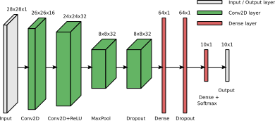
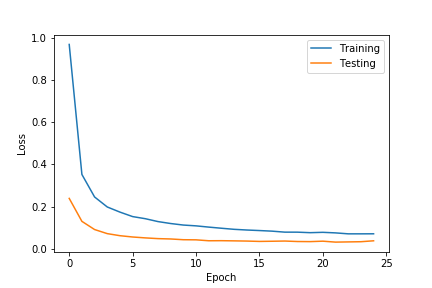
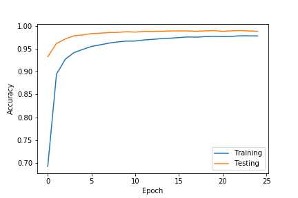
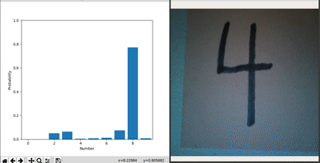

# Keras-MNIST-to-TPU

Training a CNN model in Keras on the MNIST data. The model is then converted to
TFLite and compiled for the Edge TPU. Webcam data can then be processed in
near-real-time through CV2 to predict digits of handwritten numbers on cards.

## Keras model (keras_mnist.py)

A sequential model is built within Keras. It consists of 2 2D convolutional
layers, a 2D max pooling layer, two dropout layers and two fully connected
layers. The model consists of a total of 135k parameters.

      Model: "sequential"
      _________________________________________________________________
      Layer (type)                 Output Shape              Param #   
      =================================================================
      conv2d (Conv2D)              (None, 26, 26, 16)        160       
      _________________________________________________________________
      conv2d_1 (Conv2D)            (None, 24, 24, 32)        4640      
      _________________________________________________________________
      max_pooling2d (MaxPooling2D) (None, 8, 8, 32)          0         
      _________________________________________________________________
      dropout (Dropout)            (None, 8, 8, 32)          0         
      _________________________________________________________________
      flatten (Flatten)            (None, 2048)              0         
      _________________________________________________________________
      dense (Dense)                (None, 64)                131136    
      _________________________________________________________________
      dropout_1 (Dropout)          (None, 64)                0         
      _________________________________________________________________
      dense_1 (Dense)              (None, 10)                650       
      =================================================================
      Total params: 136,586
      Trainable params: 136,586
      Non-trainable params: 0
      _________________________________________________________________

The model converges to an training/testing accuracy of 99.3% on training and 98.8 on testing indicating a bit
of overfitting.

 

Some regularization or reduction of model complexity may show
further improvement. As the focus of this project is on the conversion and
deployment of the model to the Google Coral Edge-TPU Accelerator, the accuracy
is considered to be sufficient.

## TFLite exportation and EdgeTPU conversion and compilation

      The documentation on the export requirements for EdgeTPU deployment is fairly
      scarce. After trail and error experimentation, the following options produce a
      working model. Further improvements may be possible:

      ##### GENERATOR FOR SAMPLE INPUT DATA TO QUANTIZE ON
      def representative_dataset_gen():
          for i in range(100):
              yield [X_train[i, None].astype(np.float32)]

      ##### CREATE CONVERTER
      #converter = tf.lite.TFLiteConverter.from_keras_model(model) # <-- ISSUES GETTING QUANTIZED!
      converter = tf.compat.v1.lite.TFLiteConverter.from_keras_model_file('keras_model.h5')

      ##### SHOW MODEL WHAT DATA WILL LOOK LIKE
      converter.representative_dataset = representative_dataset_gen

      ##### QUANTIZE INTERNALS TO UINT8
      #converter.optimizations = [tf.lite.Optimize.OPTIMIZE_FOR_SIZE]
      converter.optimizations = [tf.lite.Optimize.DEFAULT]

      ##### REDUCE ALL INTERNAL OPERATIONS TO UNIT8
      converter.target_spec.supported_ops = [tf.lite.OpsSet.TFLITE_BUILTINS_INT8]
      converter.inference_input_type = tf.uint8
      converter.inference_output_type = tf.uint8
      converter.inference_type = tf.float32

      ##### CONVERT THE MODEL
      tflite_model = converter.convert()

      ##### SAVE MODEL TO FILE
      tflite_model_name = "mnist.tflite"
      open(tflite_model_name, "wb").write(tflite_model)

The resulting `tflite` model can then be compiled using `edgetpu_compiler -s mnist.tflite`.
With the above options, all operations are mapped to the TPU.

## Inferencing (gctpu_mnist.py)

A simple proof of concept was impelemented, getting near-real-time camera images
from the webcam and sending a preprocessed image to the TPU for inferencing.

Both inference results and processed image are displayed to allow for
interactivity with user.

